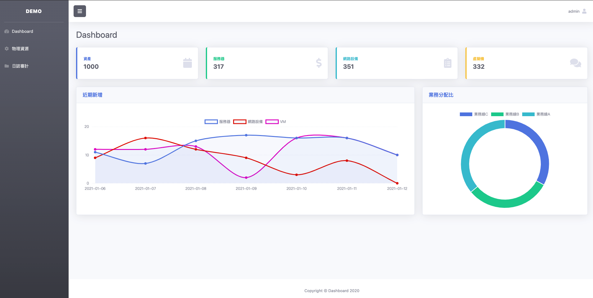
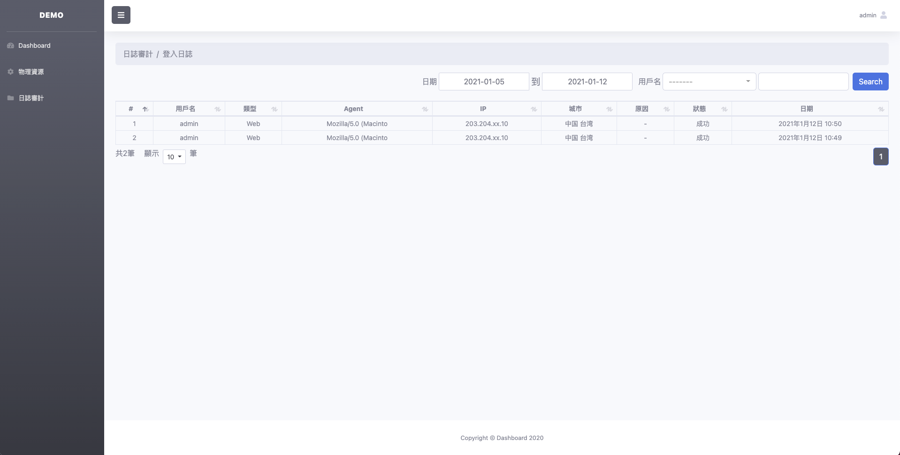

# 說明
簡易的Dashboard,支持表單查詢 分頁器、圖表顯示、用戶登入獲取真實IP歷史。

# 依賴套件版本

後端
```
Django==3.1
ipip-ipdb==1.3.2
```

前端
```
bootstrap4
jquery
DataTables
bootstrap-select
bootstrap-datepicker
```

# 演示地址

地址: https://mtd1.herokuapp.com/

帳號: admin / 9dvYbU83 

## 首頁登入


## 登入列表
